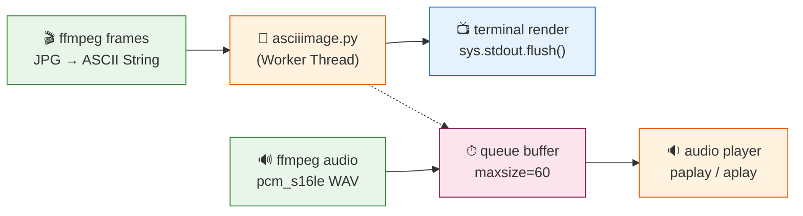

# ascii_video_viewer

**A terminal video player in ASCII art.** Extracts frames from a video, converts them to ASCII using `asciiimage.py`, and plays the result in sync with the original audio.

## Installation

```bash
git clone https://github.com/Zahnschmelz/ascii_video_viewer.git
cd ascii_video_viewer
```

### Create a virtual environment and install dependencies

```bash
python3 -m venv .venv
source .venv/bin/activate
pip install -r requirements.txt
```

### System dependencies

| Package | Purpose |
|---------|---------|
| `ffmpeg` / `ffprobe` | Frame & audio extraction |
| `paplay` (PulseAudio) or `aplay` (ALSA) | Audio sync playback |

Install ffmpeg and the audio player for your distribution:

```bash
# Debian / Ubuntu
sudo apt install ffmpeg libpulse0 alsa-utils

# Fedora
sudo dnf install ffmpeg pulseaudio-utils

# Arch / CachyOS
sudo pacman -S ffmpeg pulseaudio-alsa

# openSUSE
sudo zypper install ffmpeg pulseaudio-utils alsa-utils
```

## Usage

```bash
python asciivideo.py <video_path> [width] [fps]
```

| Argument | Description | Default |
|----------|-------------|---------|
| `video_path` | Path to a video file (mp4, mkv, avi, …) | — |
| `width` | Terminal width in characters | `127` |
| `fps` | Target framerate (downsampling, e.g. `15`) | Original FPS |

### Examples

```bash
# Default: full resolution, original FPS
python asciivideo.py ~/Videos/clip.mp4

# Narrower terminal, slower playback
python asciivideo.py ~/Videos/clip.mp4 80 10

# Video only, no audio
# (if paplay/aplay is unavailable)
python asciivideo.py ~/Videos/clip.mp4 127
```

## How It Works

1. **Extraction** – `ffmpeg` renders all frames as JPGs and the audio stream as a WAV file.
2. **Downsampling** – Optional: only every n-th frame is kept to reach a target FPS.
3. **Conversion** – `asciiimage.py` is called for each frame (parallel via `ThreadPoolExecutor`).
4. **Sync Playback** – Frames are rendered at exact audio timing via `time.sleep()`; if rendering falls behind, frames are dropped.
5. **Cleanup** – The temporary directory is removed after playback.

## Architecture



## Limitations

- **Audio Sync** requires `paplay` (PulseAudio) or `aplay` (ALSA); without it, only video mode is available.
- **Single-Threaded Render** per frame (subprocess overhead). For faster playback, lower `target_fps`.

## License

MIT – see `LICENSE`.

---

*Developed by [Zahnschmelz](https://github.com/Zahnschmelz/). Temporary caches are stored in the temp directory and removed after playback.*
