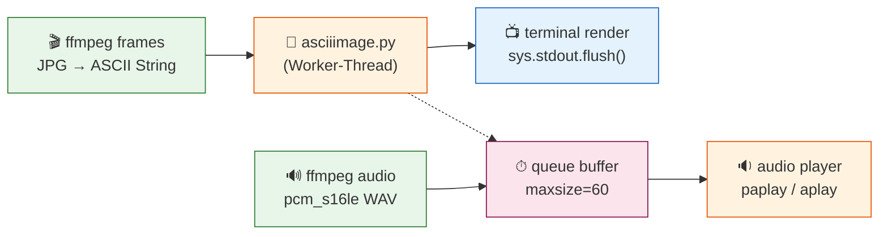

# ascii_video_viewer

**Video-Player in ASCII-Text.** Extrahiert Frames aus Videos, wandelt sie per `asciiimage.py` in ASCII um und spielt das Ergebnis synchron mit dem Original-Audio ab.

## Installation

```bash
git clone https://github.com/Zahnschmelz/ascii_video_viewer.git
cd ascii_video_viewer
```

### Abhängigkeiten

| Paket | Zweck |
|-------|-------|
| Python 3.10+ | Laufzeit |
| `ffmpeg` / `ffprobe` | Frame- & Audio-Extraktion |
| `paplay` oder `aplay` | Audio-Sync (optional) |
| `asciiimage.py` | Frame → ASCII Konverter (externes Script, standardmäßig unter `~/.local/bin/asciiimage.py`) |

## Usage

```bash
python asciivideo.py <video_path> [width] [fps]
```

| Argument | Beschreibung | Default |
|----------|-------------|---------|
| `video_path` | Pfad zu einer Video-Datei (mp4, mkv, avi, …) | — |
| `width` | Terminal-Breite in Zeichen | `127` |
| `fps` | Ziel-Framerate (Downsampling, z.B. `15`) | Original-FPS |

### Beispiele

```bash
# Standard: volle Auflösung, Original-FPS
python asciivideo.py ~/Videos/clip.mp4

# Schmaleres Terminal, langsamer
python asciivideo.py ~/Videos/clip.mp4 80 10

# Nur Video, kein Audio
# (falls paplay/aplay fehlt)
python asciivideo.py ~/Videos/clip.mp4 127
```

## Funktionsweise

1. **Extraktion** – `ffmpeg` rendert alle Frames als JPG und den Audio-Stream als WAV.
2. **Downsampling** – optional: nur jeden n-ten Frame wird behalten, um auf eine Ziel-FPS zu kommen.
3. **Konvertierung** – `asciiimage.py` wird pro Frame aufgerufen (parallell über `ThreadPoolExecutor`).
4. **Sync-Playback** – Frames werden per `time.sleep()` exakt zum Audio-Takt gerendert; wenn der Render-Prozess nachhinkt, werden Frames gedropped.
5. **Cleanup** – Temporär-Verzeichnis wird am Ende entfernt.

## Architektur



## Limitierungen

- **Abhängig von `asciiimage.py`** – muss separat installiert sein.
- **Audio-Sync** benötigt `paplay` (PulseAudio) oder `aplay` (ALSA); ohne nur Video-Modus.
- **Single-Threaded Render** pro Frame (subprocess-Overhead). Für schnellere Wiedergabe `target_fps` senken.

## Lizenz

MIT – see `LICENSE` (falls vorhanden).

---

*Entwickelt von [Zahnschmelz](https://github.com/Zahnschmelz/). Caches werden im Temp-Verzeichnis abgelegt und nach Playback entfernt.*
